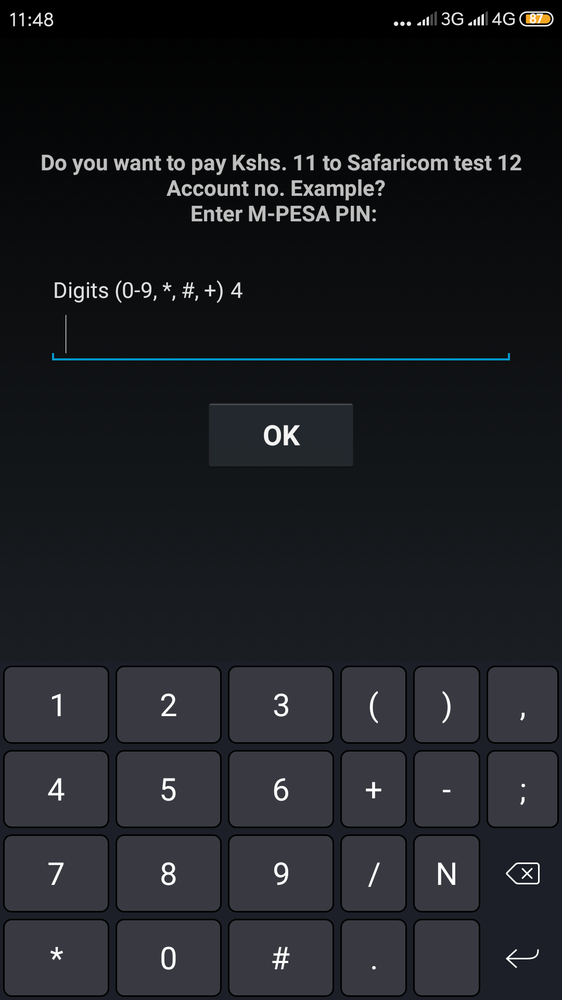

# Lipa Na Mpesa Online

A Nodejs implementation of Safaricom's Lipa na Mpesa Online Payment Api. Use this as a template and replace with your own values where necessary.

## Requirements

Credentials are required including:

* Consumer Key
* Consumer Secret

They can be gotten by registering for an account here [https://developer.safaricom.co.ke/](https://developer.safaricom.co.ke/)

## Installing

To automatically get the correct dependencies used in this project, ensure you have [Node.js](https://nodejs.org/en/download/) installed then:

1. Clone the project by running `git clone https://github.com/petekmunz/Lipa-Na-Mpesa_Nodejs.git` in your Git terminal.
2. In your terminal ensure you are in the directory `Lipa-Na-Mpesa_Nodejs` then run `npm install`

When all the requisite variables have been input, a succesful request will result in a STK push as shown below

 
